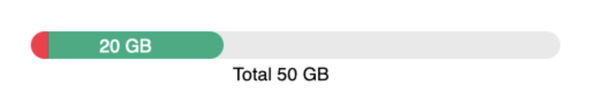

# angular14-test-task-from-ddn

[Edit on StackBlitz ⚡️](https://stackblitz.com/edit/angular14-sharebuttons-jqg9o5)

Task: Implement a multi-level bar component in Angular
Description: Build a single html page to demo the use of the component you’ll be implementing and demoing all the features as listed below.
Design:

Component: A responsive Angular bar component that shows 3 values – total capacity, allocated capacity & used capacity out of allocated capacity.
Features:
1. Accept & validate 3 values:
   a. Total capacity in bytes
   b. Allocated capacity in bytes ( <= total)
   c. Used Capacity in bytes ( <= allocated)
2. The Total is represented by the bar’s gray background above.
3. The Allocated is represented by the green portion in the bar above.
4. The Used is represented by the red portion in the bar above.
5. The entire component should be responsive and take the entire width of its container.
6. All 3 bar parts should be displayed with rounded corners on both sides as shown above,
   except for when:
   a. Either the allocated or used don’t have enough width to be displayed as a full
   circle (depends on the border radius & total bar width) – in that case, it would be
   displayed with only the left side rounded (see red part above).
   b. Either the allocated or used parts are equal to 0 – in that case, they will not be
   displayed, but if they are > 0, (a) above may apply.
7. Implement a helper function that formats bytes into the closest units
   (B/KB/MB/GB/TB/etc.) with the following precision rule:
   a. XXX.YYY => XXX (3 digits => non after decimal point)
   b. XX.YYY => XX.Y (2 digits => 1 after decimal point)
   c. X.YYY => X.YY (1 digit => 2 after decimal point)
   d. Example: 123456 Bytes => 123 KB, 1234567 => 1.23 MB, 12345678 => 12.3 MB
8. Both allocated & used portions should display the formatted capacity in their center. If there’s not enough space to show it – hide the entire text (see red part above).
9. Display the total capacity, formatted & centered, under the bar.
   If something isn’t clear or if you have questions – please do ask.
